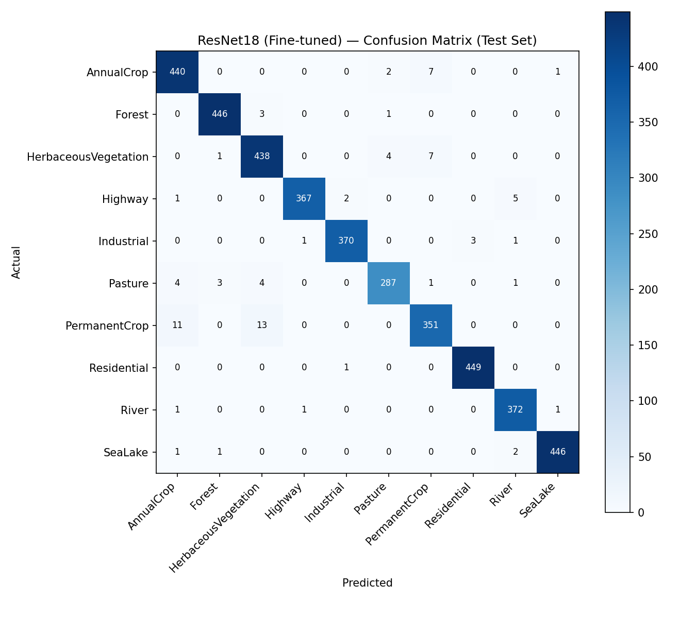
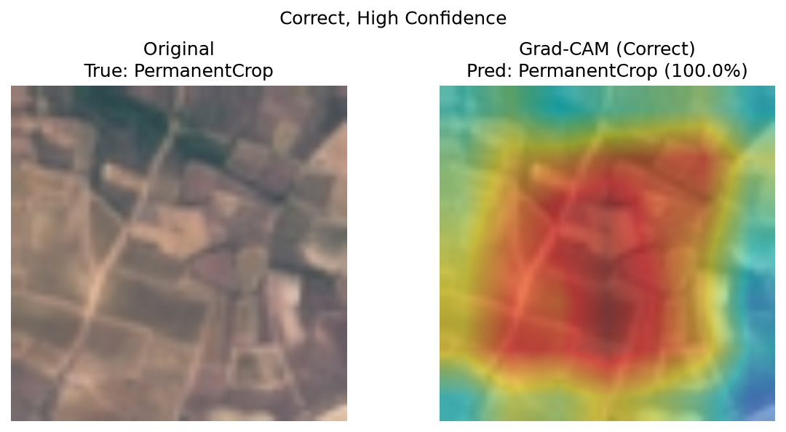

# Satellite Image Land-Cover Classification

Deep learning system for classifying satellite imagery into 10 land-cover
categories, built with PyTorch and transfer learning, including model
explainability (Grad-CAM), systematic error analysis, and a Streamlit web
application.

## Overview

This project classifies Sentinel-2 satellite image tiles into one of 10
land-cover classes (e.g. Forest, Highway, River, Residential) using a
fine-tuned ResNet18 convolutional neural network. It was built as an
end-to-end demonstration of applied computer vision engineering: dataset
verification, exploratory data analysis, a documented baseline-to-transfer-
learning progression, controlled experiments, explainability, and a
deployed inference application — not just a single trained model.

## Problem Statement

Automated land-cover classification from satellite imagery supports
applications in urban planning, agriculture monitoring, and environmental
tracking. This project builds a classifier that takes a single RGB
satellite image tile and predicts its dominant land-cover type, along with
a confidence score and an explanation of which image regions influenced
that prediction.

## Project Goals

- Build a reproducible, documented computer vision pipeline from raw data
  to deployed application
- Compare a from-scratch baseline CNN against transfer learning, with
  controlled, documented experiments
- Provide honest, evidence-based evaluation — including where the model
  fails and why
- Deploy the final model behind a usable web interface with live
  explainability

## Dataset

**EuroSAT (RGB version)**
- Source: [Zenodo, official release](https://zenodo.org/records/7711810) (DOI: 10.5281/zenodo.7711810)
- 27,000 labeled images, 64×64 pixels, RGB, derived from Sentinel-2 satellite imagery
- 10 classes, verified via `src/data/verify_dataset.py`:
  - 3,000 images each: AnnualCrop, Forest, HerbaceousVegetation, Residential, SeaLake
  - 2,500 images each: Highway, Industrial, PermanentCrop, River
  - 2,000 images: Pasture
- License: MIT
- Verified: 0 corrupted images, all images consistently 64×64, 3-channel RGB

## Classes

`AnnualCrop`, `Forest`, `HerbaceousVegetation`, `Highway`, `Industrial`,
`Pasture`, `PermanentCrop`, `Residential`, `River`, `SeaLake`

## Methodology
Satellite Image
↓
Preprocessing (resize to 224×224, ImageNet normalization)
↓
Data Augmentation (train only: flips, 90°-multiple rotations, mild color jitter)
↓
ResNet18 (ImageNet-pretrained, fine-tuned)
↓
Prediction (class + confidence + probability distribution)
↓
Explainability (Grad-CAM)
↓
Land-Cover Class

## Model Architecture

Three models were trained and compared:

1. **Baseline CNN** — 3 convolutional blocks (32→64→128 channels) trained
   from scratch, established as a documented lower bound.
2. **ResNet18 (frozen backbone)** — ImageNet-pretrained ResNet18 with the
   backbone frozen; only a new linear classification head (5,130
   parameters, 0.05% of the network) was trained.
3. **ResNet18 (fine-tuned)** — the frozen model's backbone was unfrozen
   and fine-tuned end-to-end using discriminative learning rates (1e-5 for
   backbone layers, 1e-4 for the head), starting from the frozen model's
   trained head. **This is the final selected model.**

Full architecture justification (why ResNet18 over ResNet50/EfficientNet/
MobileNet) is documented in `notebooks/04_transfer_learning.ipynb`.

## Training

- **Split:** 70% train / 15% validation / 15% test, stratified by class,
  fixed seed (42), leak-free at the file level (see `REPRODUCIBILITY.md`)
- **Normalization:** computed from the training split only (baseline
  model) or ImageNet statistics (transfer learning models, matching the
  pretrained backbone's expected input distribution)
- **Augmentation:** horizontal/vertical flips and 90°-multiple rotations
  (physically valid for overhead imagery with no canonical orientation),
  plus mild brightness/contrast jitter. Arbitrary-angle rotation and
  aggressive cropping were deliberately avoided — see
  `notebooks/02_data_preparation.ipynb` for full reasoning.
- **Hardware:** baseline and frozen-backbone models trained locally on
  CPU; fine-tuning was performed on a Google Colab T4 GPU. Full details
  in `REPRODUCIBILITY.md`.

## Evaluation

| Model | Test Accuracy | Macro F1 | Weighted F1 |
|---|---|---|---|
| Baseline CNN | 92.15% | 0.9192 | 0.9216 |
| ResNet18 (frozen backbone) | 93.21% | 0.9295 | 0.9321 |
| **ResNet18 (fine-tuned)** | **97.93%** | **0.9787** | **0.9792** |

Macro and weighted F1 for the final model are nearly identical (0.0005
apart), indicating consistent performance across all classes, including
the smaller ones (Pasture, 300 test images) — not just the larger ones.

## Results

Per-class F1 (final model):

| Class | F1 |
|---|---|
| Residential | 1.00 |
| SeaLake / Highway / Industrial / Forest | 0.99 |
| River | 0.98 |
| Pasture / AnnualCrop | 0.97 |
| HerbaceousVegetation | 0.96 |
| PermanentCrop | 0.95 |

## Confusion Matrix



The model makes 84 errors across 4,050 test images (2.07% error rate).
72.6% of remaining errors occur within the vegetation/cropland class
family (AnnualCrop, Forest, HerbaceousVegetation, Pasture, PermanentCrop),
with PermanentCrop alone involved in 45.2% of all errors. Full analysis
in `notebooks/05_model_evaluation.ipynb`.

## Explainability

Grad-CAM was used to visualize which image regions influenced individual
predictions, for correct high-confidence, correct low-confidence, and
incorrect examples:



Grad-CAM shows correlation between image regions and model output — it
is not proof of the model's reasoning process. Full discussion, including
all three example categories, is in
`notebooks/05_model_evaluation.ipynb`.

## Error Analysis

A systematic scan of all 84 test-set errors found they are concentrated,
not scattered: nearly three-quarters occur between visually and
spectrally similar vegetation/cropland classes, consistent with EDA
findings from Phase 4 that flagged AnnualCrop and PermanentCrop as having
near-identical mean RGB profiles. This pattern persisted (in shrinking
form) across all three trained models, suggesting a genuine information
ceiling from single-image, single-timestamp overhead imagery rather than
a fixable training deficiency. Full analysis in
`reports/error_analysis.json` and `notebooks/05_model_evaluation.ipynb`.

## Demo

The Streamlit application allows uploading a satellite image and viewing
the predicted class, confidence, full probability distribution, and a
live Grad-CAM explainability overlay.

*(Add a screenshot or GIF of the running app here before publishing —
use only EuroSAT test images or your own imagery, not copyrighted stock
photos.)*

## Installation

```bash
git clone https://github.com/ali79850/satellite-land-cover-classification.git
cd satellite-land-cover-classification
python -m venv venv
venv\Scripts\activate          # Windows
pip install -r requirements.txt
```

## Usage

```bash
# Download and verify the dataset
python src/data/download_dataset.py
python src/data/verify_dataset.py

# Run the web app (uses the pre-trained final model)
streamlit run app/app.py
```

Full pipeline reproduction (training from scratch) is documented in
`REPRODUCIBILITY.md`.

## Project Structure
satellite-land-cover-classification/
├── data/ # Dataset (raw + processed manifest, gitignored)
├── notebooks/ # EDA, data prep, baseline, transfer learning, evaluation
├── src/
│ ├── data/ # Download, verification, split, transforms
│ ├── models/ # Model architectures, final model packaging
│ ├── training/ # Training scripts (baseline, frozen, fine-tune)
│ ├── evaluation/ # Test-set evaluation, error analysis
│ ├── explainability/ # Grad-CAM implementation
│ └── inference/ # Standalone prediction pipeline
├── app/ # Streamlit application
├── models/ # Trained model weights + config (gitignored, see below)
├── reports/ # Figures, logs, evaluation JSON reports
├── tests/ # Automated test suite
├── requirements.txt
├── REPRODUCIBILITY.md
└── README.md

## Reproducibility

See [`REPRODUCIBILITY.md`](REPRODUCIBILITY.md) for exact environment
versions, random seeds, dataset checksums, training times, and full
step-by-step pipeline reproduction instructions.

## Limitations

- The model has been evaluated only on EuroSAT (Sentinel-2, 64×64,
  single-dominant-class tiles) and has not been validated on imagery from
  other sensors, resolutions, or altitudes (e.g. drone/aerial photography
  contains mixed land-cover per frame, which this model cannot handle —
  confirmed via manual testing).
- PermanentCrop remains the weakest class (F1 0.95) due to genuine visual/
  spectral ambiguity with AnnualCrop and HerbaceousVegetation at this
  resolution — likely a ceiling imposed by single-timestamp imagery rather
  than a fixable model deficiency.
- Grad-CAM visualizations are illustrative and approximate, not proof of
  model reasoning.
- EuroSAT's tile-level train/val/test split does not account for possible
  near-duplicate tiles from adjacent regions of the same satellite scene
  (no scene metadata is provided by the dataset to check this).

## Future Improvements

- Multispectral (13-band Sentinel-2) input, requiring a backbone trained
  or adapted for non-RGB channels
- Systematic Grad-CAM analysis aggregated across many examples per class,
  rather than illustrative single examples
- Learning-rate scheduling and early stopping (identified but not
  explored in the Phase 9 experiment set)
- Validation on out-of-distribution imagery (different sensors/altitudes)

## License

This project's code is available under the MIT License. The EuroSAT
dataset is separately licensed under MIT by its original authors — see
the [official dataset page](https://zenodo.org/records/7711810) for
details.